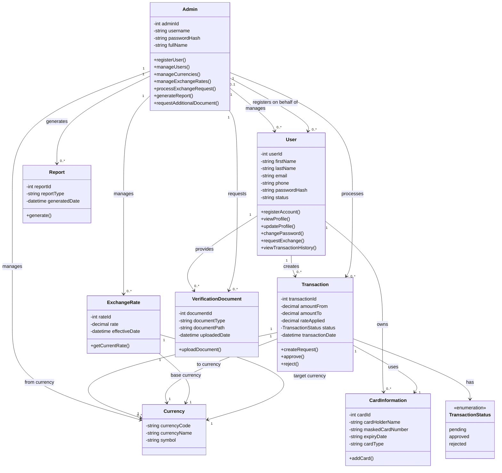

# Money Exchange System — Class Diagram Design

## 1. Class Diagram Scope

A single class diagram is sufficient because the system is relatively small and the major use cases revolve around a small set of core domain objects. Creating separate class diagrams for User and Admin would duplicate several classes and relationships without adding significant value.

The class diagram will focus on the **domain model** of the Money Exchange System.

---


## 2. Purpose

The class diagram represents the overall structure of the Money Exchange System and supports all use cases defined in the Use Case Diagram.


## 3. Main Classes

| Class                  | Responsibility                                                                               |
| ---------------------- | -------------------------------------------------------------------------------------------- |
| `User`                 | Represents a customer who can register, manage their profile, and request currency exchanges |
| `Admin`                | Represents staff who manage users and currencies and process exchange requests               |
| `Transaction`          | Represents a currency exchange request and its processing status                             |
| `Currency`             | Represents a supported currency                                                              |
| `ExchangeRate`         | Represents an exchange rate between two currencies                                           |
| `CardInformation`      | Represents the funding card attached to an exchange request                                  |
| `VerificationDocument` | Represents optional documents requested during account verification                          |
| `Report`               | Represents a report generated by an Admin                                                    |
| `TransactionStatus`    | Enumeration representing `pending`, `approved`, and `rejected` transaction states            |

---

## 4. Class Diagram



---

# 5. Class Responsibilities and Functionality

## 5.1 User

The `User` class represents a self-service customer.

### Responsibilities

* Register an account
* View their profile
* Update their profile
* Change their password
* Request a currency exchange
* View their transaction history

### Main attributes

```text
userId
firstName
lastName
email
phone
passwordHash
status
```

### Main functionality

```text
registerAccount()
viewProfile()
updateProfile()
changePassword()
requestExchange()
viewTransactionHistory()
```

---

## 5.2 Admin

The `Admin` class represents a staff member who manages the system.

### Responsibilities

* Register users on behalf of customers
* Manage users
* Manage currencies
* Manage exchange rates
* Process exchange requests
* Request additional verification documents
* Generate reports

### Main functionality

```text
registerUser()
manageUsers()
manageCurrencies()
manageExchangeRates()
processExchangeRequest()
generateReport()
requestAdditionalDocument()
```

The Admin class therefore represents the administrative actor from the Use Case Diagram.

---

## 5.3 Transaction

The `Transaction` class represents a user's currency exchange request.

### Main attributes

```text
transactionId
amountFrom
amountTo
rateApplied
status
transactionDate
```

### Main functionality

```text
createRequest()
approve()
reject()
```

The transaction status is represented using the `TransactionStatus` enumeration:

```text
pending
approved
rejected
```

A newly created exchange request starts with:

```text
pending
```

After an Admin processes the request, it becomes either:

```text
approved
```

or:

```text
rejected
```

There is no need to create separate classes such as `PendingTransaction`, `ApprovedTransaction`, or `RejectedTransaction`.

---

## 5.4 Currency

The `Currency` class represents a currency supported by the system.

### Main attributes

```text
currencyCode
currencyName
symbol
```

Examples include:

```text
NZD — New Zealand Dollar — $
USD — United States Dollar — $
EUR — Euro — €
```

The Admin can manage currencies through the **Manage Currencies** use case.

---

## 5.5 ExchangeRate

The `ExchangeRate` class represents the exchange rate between two currencies.

### Main attributes

```text
rateId
rate
effectiveDate
```

Each exchange rate is associated with:

* One base currency
* One target currency

For example:

```text
NZD → USD
Rate: 0.5900
```

This class supports the **View Exchange Rate** and **Manage Currencies / Rates** use cases.

---

## 5.6 CardInformation

The `CardInformation` class represents the funding card used for an exchange request.

This class is required because:

> **Request Exchange Money «include» Add Card Information**

Every exchange request must have a funding card attached.

The relationship is therefore:

```text
Transaction "1" --> "1" CardInformation
```

This means each transaction must use one card.

For security reasons, the class should not store an unprotected full card number. A masked value or payment-provider token should be used instead.

---

## 5.7 VerificationDocument

The `VerificationDocument` class represents an additional document requested during account registration.

It supports:

> **Request Additional Document «extend» Register Account**

The relationship is:

```text
User "1" --> "0..*" VerificationDocument
```

The `0..*` indicates that verification documents are optional.

A user may have:

```text
0 documents
```

or:

```text
1 or more documents
```

This correctly represents the conditional nature of the `extend` relationship.

---

## 5.8 Report

The `Report` class represents a report generated by an Admin.

It supports:

> **Generate Report**

The report can use information from:

* Users
* Transactions
* Currencies

The class is intentionally kept simple because the current project scope does not define different report types with different behaviours.

---

# 6. Relationships

## User and Transaction

```text
User "1" --> "0..*" Transaction
```

One User can create zero or many exchange transactions.

This supports:

* Request Exchange Money
* View Transaction History

---

## User and CardInformation

```text
User "1" --> "0..*" CardInformation
```

A User can have one or more saved funding cards.

A transaction uses one specific card:

```text
Transaction "1" --> "1" CardInformation
```

---

## User and VerificationDocument

```text
User "1" --> "0..*" VerificationDocument
```

Verification documents are optional because the **Request Additional Document** use case extends registration only when additional verification is required.

---

## Admin and User

```text
Admin "1" --> "0..*" User
```

An Admin can manage multiple users.

An Admin may also register a user on their behalf.

This corresponds to the requirement that `users.registered_by` can be:

```text
NULL
```

when the user registers themselves, or contain an Admin ID when an Admin registers the account.

---

## Admin and Transaction

```text
Admin "1" --> "0..*" Transaction
```

An Admin can process multiple exchange requests.

Processing results in the transaction becoming either:

```text
approved
```

or:

```text
rejected
```

---

## Transaction and Currency

A transaction involves two currencies:

```text
Transaction
    |
    +---- from currency
    |
    +---- to currency
```

For example:

```text
NZD → USD
```

The two relationships use the same `Currency` class but have different roles.

---

## ExchangeRate and Currency

An exchange rate also connects two currencies:

```text
ExchangeRate
    |
    +---- base currency
    |
    +---- target currency
```

For example:

```text
NZD → USD = 0.5900
```

---


# 7. Use Case to Class Mapping

| Use Case                    | Main Class(es)                                                       |
| --------------------------- | -------------------------------------------------------------------- |
| Register Account            | `User`, `Admin`                                                      |
| View Profile                | `User`                                                               |
| Update Profile              | `User`                                                               |
| Change Password             | `User`                                                               |
| View Exchange Rate          | `ExchangeRate`, `Currency`                                           |
| Request Exchange Money      | `User`, `Transaction`, `CardInformation`, `Currency`, `ExchangeRate` |
| Add Card Information        | `CardInformation`                                                    |
| View Transaction History    | `User`, `Transaction`                                                |
| Manage Currencies           | `Admin`, `Currency`, `ExchangeRate`                                  |
| Manage Users                | `Admin`, `User`                                                      |
| Generate Report             | `Admin`, `Report`                                                    |
| Process Exchange Request    | `Admin`, `Transaction`                                               |
| Approve the Request         | `Transaction`                                                        |
| Reject the Request          | `Transaction`                                                        |
| Request Additional Document | `Admin`, `User`, `VerificationDocument`                              |

---

