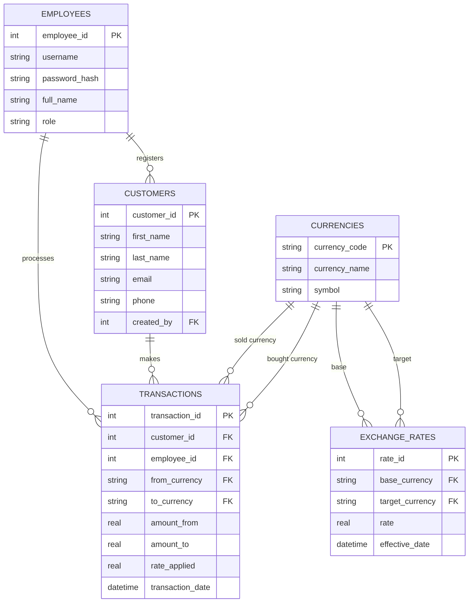

# Money Exchange System

This document covers the database design for Money Exchange System using the ER diagram and the justification for each table. 

## Entity-Relationship Diagram

### 1. `employees`

The employee table is created since at least the employee - **administrator** should manage customers and transactions.

### 2. `customers`
The people the business serves.
- the same customer will make repeat transactions, and their details
  (name, contact info) should only be entered once
- the employee admin needs a customer list to manage independently of any
  single transaction (add, edit, view a customer's history)
- `created_by` links back to `employees`

### 3. `currencies`
A controlled lookup of the currencies the business trades (e.g. USD, NZD,
EUR — code, full name, symbol). This exists so that:
- `exchange_rates` and `transactions` can reference a **validated** set of
  currency codes via foreign keys, instead of free-text fields that could
  contain typos or unsupported currencies
- currency display info (name, symbol) is defined once, not repeated
  everywhere it's used

### 4. `exchange_rates`
Rates change over time, and once a transaction has happened, the rate that
was actually used at that moment must stay retrievable even after today's
rate changes. So this is modeled as a running log: each rate update is a
**new row** with its own `effective_date`, not an overwrite of a single
"current rate" value. This gives:
- an audit trail of how rates moved over time
- the ability to look up "what was the rate on date X"
- `base_currency` / `target_currency` are foreign keys into `currencies`,
  which also stops a currency from being exchanged into itself

### 5. `transactions`
This table is created to store all the transactions to exchange an amount of one currency for another. Each row ties together
**who** made it (`customer_id`), **which employee admin processed it**
(`employee_id` — directly supporting the "admin manages transactions"
requirement), and **what** was exchanged (currencies, amounts, rate).
`amount_to` is *derived* (`amount_from × rate_applied`), never entered
directly, so figures can't be entered inconsistently.

Note: Regarding *real* data type, since SQLite has no native DECIMAL, I use *real* data type. 
In production I would actually push back on SQLite entirely for a real money-exchange system — I'd use PostgreSQL, which has a genuine NUMERIC(p,s) type with arbitrary fixed-point precision enforced by the database itself

## Relationship summary

- One **employee** registers many **customers** (`customers.created_by`)
- One **employee** processes many **transactions** (`transactions.employee_id`)
- One **customer** makes many **transactions** (`transactions.customer_id`)
- One **currency** can appear as the base or target of many
  **exchange rates**, and as the sold or bought currency in many
  **transactions**

