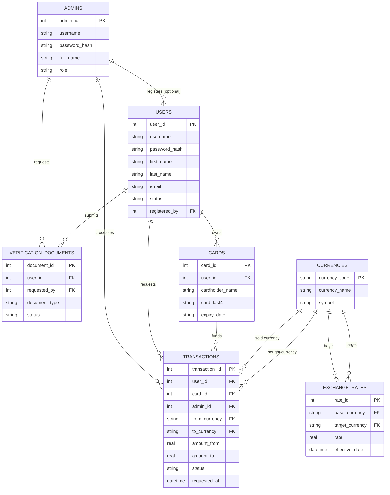

# Money Exchange System

This document covers the database design for Money Exchange System using the ER diagram and the justification for each table. 

## Entity-Relationship Diagram

| Table | Reason |
|---|---|
| `users` | Users log in themselves (View/Update Profile, Change Password use cases)|
| `admins` | staff who manage the platform |
| `cards` |  Required by the mandatory `«include»` from Request Exchange Money → Add Card Information; a user can have multiple cards, so it's its own table|
| `currencies` |  controlled lookup of tradeable currencies |
| `exchange_rates` | Rate history; now read by **View Exchange Rate** and maintained via **Manage Currencies** |
| `transactions` | request lifecycle (pending → approved/rejected) per **Process Exchange Request** |
| `verification_documents` | Required by the optional `«extend»` from Register Account → Request Additional Document; only populated when an admin actually asks for more documents |

## 6. Relationship summary

- One **admin** may manage many **users** (optional — `registered_by` can be `NULL`)
- One **admin** processes many **transactions**; one **admin** may request many **verification documents**
- One **user** makes many **transactions**, owns many **cards**, and may submit many **verification documents**
- One **card** can fund many **transactions**
- One **currency** can be the base or target of many **exchange rates**, and the sold or bought currency in many **transactions**
