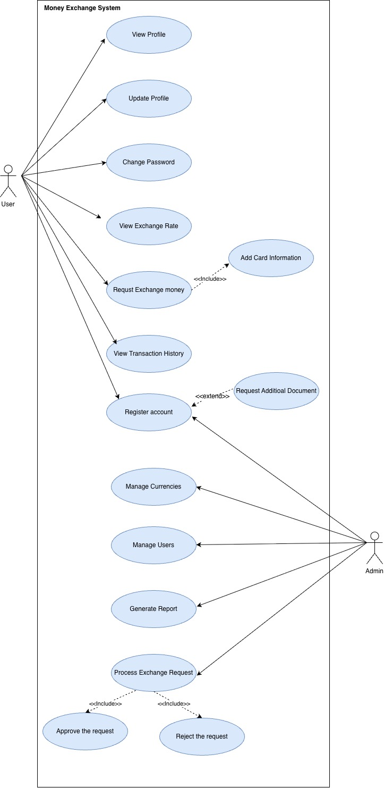

 # Money Exchange System

This document describes Use Case Diagram for Money Exchange System. 

 ## Use case diagram

### User
A self-service customer. Registers their own account, logs in, manages their
own profile, and requests currency exchanges.

### Admin
A staff member. Manages platform-wide data (currencies, users) and reviews
exchange requests submitted by Users.

## Use cases and relationships

### Association 

| Use case | Actor(s) | What it does |
|---|---|---|
| View Profile | User | Displays the logged-in user's own account details |
| Update Profile | User | Edits name, email, phone on the user's own account |
| Change Password | User | Updates the user's own `password_hash` |
| View Exchange Rate | User | Reads current rates from `exchange_rates` / `currencies` |
| Request Exchange Money | User | Creates a new `transactions` row with `status = 'pending'` |
| View Transaction History | User | Lists the user's own past requests/transactions |
| Register Account | User **and** Admin | A user can self-register; an admin can also register an account on a user's behalf (e.g. in person) |
| Manage Currencies | Admin | CRUD on `currencies` (and their rates) |
| Manage Users | Admin | CRUD on `users` — view, edit, suspend accounts |
| Generate Report | Admin | Reads/aggregates `transactions`, `users`, `currencies` on demand |
| Process Exchange Request | Admin | Reviews a pending request and moves it to approved or rejected |

Two actors sharing **Register Account** is why the updated schema gives `users`
a nullable `registered_by` foreign key to `admins` — `NULL` means the user
registered themselves; a value means an admin registered them.

### Include (dashed arrow, base → included — always happens, no exceptions)

- **Request Exchange Money «include» Add Card Information**
  Every exchange request must have a funding card attached — this isn't
  optional, so it's include, not extend. 

- **Process Exchange Request «include» Approve the Request**
- **Process Exchange Request «include» Reject the Request**
  Every time an admin processes a request, the outcome is always one of these
  two — there's no third path. Rather than modelling these as separate tables,
  they're represented as the two terminal values of `transactions.status`
  (`approved` / `rejected`), with `pending` as the initial state before
  processing.

### Extend (dashed arrow, extension → base — optional, conditional)

- **Request Additional Document «extend» Register Account**
  This only happens *sometimes* — when an admin decides the submitted
  registration needs extra verification (e.g. proof of ID). Because it's
  conditional, not every registration produces this data, which is exactly
  what a nullable/optional related row in `verification_documents` models: a
  user may have zero documents (never asked) or one-plus (asked, possibly more
  than once).
