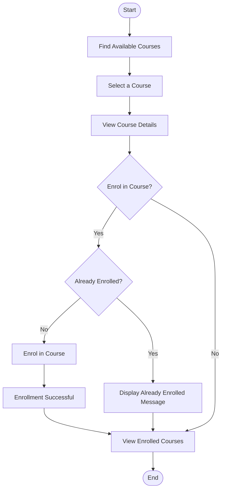
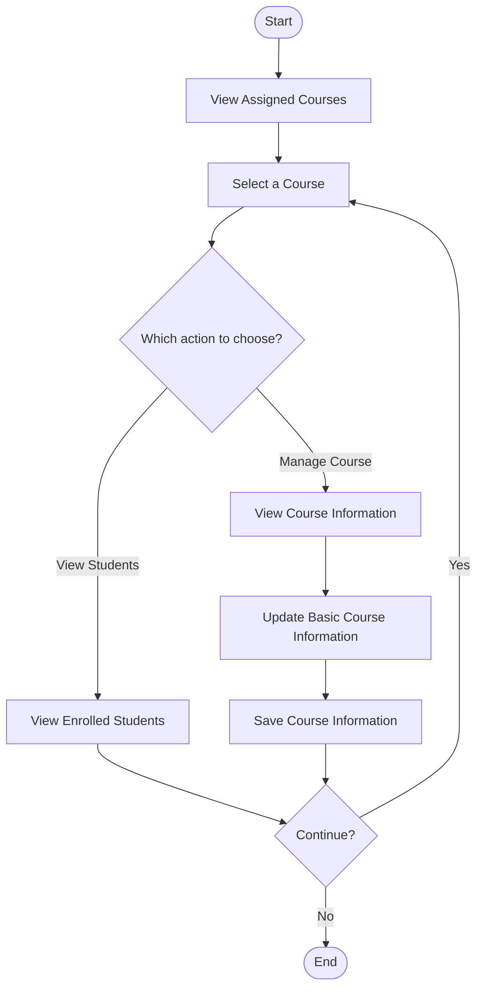

# College Management System – Activity Diagrams

## Overview

Based on the defined scope, **two activity diagrams** are created:

1. **Student Activity Diagram**
2. **Lecturer Activity Diagram**

---

# 1. Student Activity Diagram

The Student Activity Diagram represents the main workflow of a student using the College Management System. It covers finding available courses, viewing course details, enrolling in a course, and viewing enrolled courses.

---

# 2. Lecturer Activity Diagram

The Lecturer Activity Diagram represents the main workflow of a lecturer using the College Management System. It covers viewing assigned courses, viewing enrolled students, and managing basic course information.

