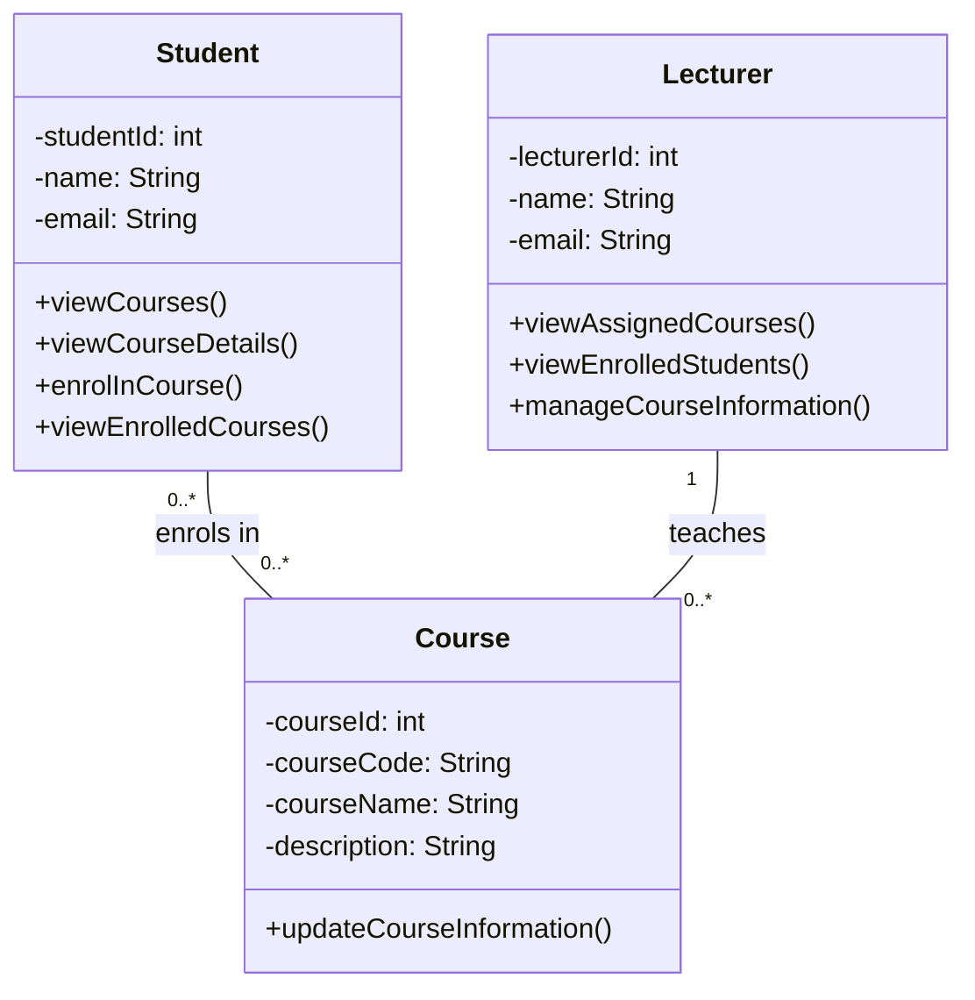

# College Management System – Class Diagram

## Overview

The class diagram contains the three core domain concepts:

* **Student**
* **Lecturer**
* **Course**

---

# Class Diagram

---

## 1. Student Class

The `Student` class represents students who use the College Management System.

### Attributes

* `studentId` – uniquely identifies a student.
* `name` – stores the student's name.
* `email` – stores the student's email address.

### Operations

* `viewCourses()` – allows the student to view available courses.
* `viewCourseDetails()` – allows the student to view information about a selected course.
* `enrolInCourse()` – allows the student to enrol in a course.
* `viewEnrolledCourses()` – allows the student to view courses they are currently enrolled in.

---

# 2. Lecturer Class

The `Lecturer` class represents lecturers who teach and manage courses.

### Attributes

* `lecturerId` – uniquely identifies a lecturer.
* `name` – stores the lecturer's name.
* `email` – stores the lecturer's email address.

### Operations

* `viewAssignedCourses()` – allows the lecturer to view their assigned courses.
* `viewEnrolledStudents()` – allows the lecturer to view students enrolled in their courses.
* `manageCourseInformation()` – allows the lecturer to update basic course information.

---

# 3. Course Class

The `Course` class represents courses offered by the college.

### Attributes

* `courseId` – uniquely identifies a course.
* `courseCode` – identifies the course, for example `CS101`.
* `courseName` – stores the course name.
* `description` – contains basic information about the course.

### Operation

* `updateCourseInformation()` – represents updating the basic information of a course.

